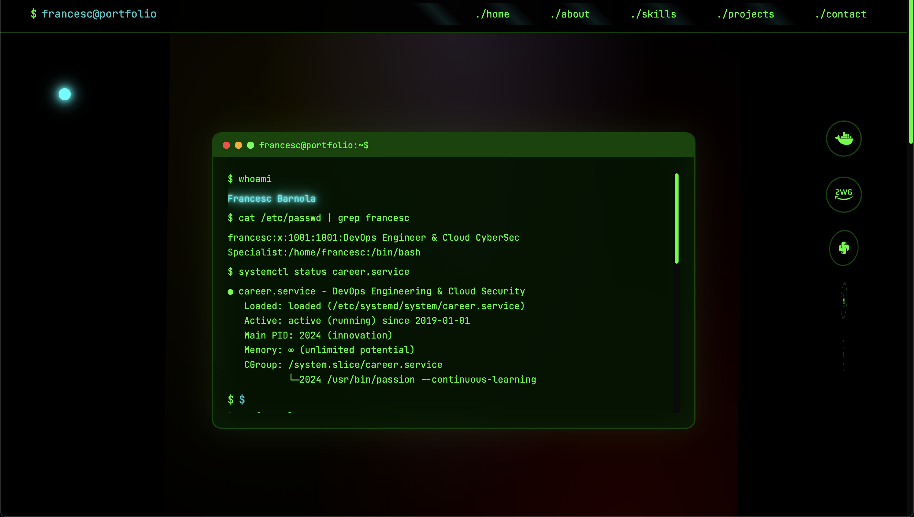

# 🌟 Matrix Terminal DevOps Portfolio

> **"Welcome to the Matrix."** - A revolutionary cyberpunk-inspired portfolio for the modern DevOps engineer.




## 🎯 Revolutionary Design Concept

This isn't just a portfolio - it's an **interactive terminal experience** that transforms your browser into a cyberpunk command center. Combining the hottest 2024 web design trends with a DevOps engineer's aesthetic, this portfolio pushes the boundaries of what's possible with modern CSS and JavaScript.

### ⚡ Cutting-Edge Features

#### 🎨 **Visual Spectacle**
- **Matrix Code Rain**: Live-generated, customizable character rain animation
- **Animated Mesh Gradients**: WebGL-performance CSS gradients with color cycling
- **Holographic Cards**: 3D transformations with realistic depth effects
- **Neon Cyberpunk Theme**: Authentic terminal colors with glitch effects
- **Custom Cyber Cursor**: Interactive cursor with particle trails

#### 🚀 **Interactive Elements**  
- **Functional Terminal**: Real commands with autocomplete and history
- **Typewriter Effects**: Dynamic text animations throughout
- **Boot Sequence**: Authentic system startup simulation
- **3D Tech Stack**: Floating, interactive technology icons
- **Audio Feedback**: Subtle sci-fi sound effects (optional)

#### 💻 **DevOps Integration**
- **System Status Displays**: Real-time style monitoring interfaces
- **Terminal Commands**: Portfolio navigation through command line
- **Infrastructure Theming**: Kubernetes, Docker, AWS inspired elements
- **Live Activity**: Simulated terminal processes and commands

### 🌐 **2024 Web Design Trends Implemented**

✅ **Mesh Gradients** - Advanced CSS gradients with animation  
✅ **Terminal UI** - Authentic command-line interfaces  
✅ **3D Interactions** - Hardware-accelerated 3D transforms  
✅ **Cyberpunk Aesthetic** - Neon colors and glitch effects  
✅ **Interactive Animations** - Scroll-triggered and hover effects  
✅ **Custom Cursors** - Branded interaction elements  
✅ **Performance First** - GPU acceleration and optimization  

## 🎮 Interactive Experience

### Terminal Commands
Try these commands in the hero terminal:
```bash
help          # View all available commands
whoami        # Learn about Francesc
skills        # Display technical skills
projects      # Show project portfolio  
contact       # Get contact information
clear         # Clear terminal output
pwd           # Show current directory
ls            # List directory contents
```

### Easter Eggs & Special Features
- **Konami Code**: `↑↑↓↓←→←→BA` activates Matrix Overdrive mode
- **Hover Effects**: Interactive 3D card transformations
- **Audio Modes**: Toggle sci-fi sound effects
- **Performance Modes**: Automatic optimization for low-end devices

## 🛠️ Technical Architecture

### Modern CSS Features
```css
/* Advanced Custom Properties */
:root {
  --matrix-green-primary: #00ff00;
  --cyber-neon-cyan: #00ffff;
  --mesh-gradient-1: radial-gradient(ellipse...);
}

/* Hardware Acceleration */
.floating-3d {
  transform-style: preserve-3d;
  will-change: transform;
  backface-visibility: hidden;
}

/* Matrix Rain Animation */
@keyframes matrix-fall {
  0% { transform: translateY(-100%); opacity: 1; }
  100% { transform: translateY(100vh); opacity: 0; }
}
```

### JavaScript Class Architecture
```javascript
class MatrixTerminalPortfolio {
  constructor() {
    this.initMatrixRain();
    this.initCyberCursor();  
    this.initTerminalCommands();
    this.initHolographicEffects();
  }
}
```

## 🚀 Getting Started

### Quick Demo
```bash
# Run the demo script
./matrix-demo.sh

# Or start manually
python3 -m http.server 8000
# Visit: http://localhost:8000
```

### File Structure
```
matrix-terminal-portfolio/
├── css/
│   ├── matrix-terminal-style.css    # Core Matrix theme
│   └── matrix-components.css        # Component styles
├── js/
│   └── matrix-terminal-main.js      # Interactive functionality
├── index.html                       # Main Matrix interface
├── matrix-demo.sh                   # Demo launcher
└── README-MATRIX.md                 # This file
```

## 📱 Responsive & Accessible

- **Mobile Optimized**: Touch-friendly interactions, optimized animations
- **Performance Focused**: GPU acceleration, reduced motion support
- **Accessibility**: Screen reader compatibility, keyboard navigation
- **Cross-Browser**: Fallbacks for unsupported features

## 🎨 Color Palette

| Color | Hex | Usage |
|-------|-----|-------|
| Matrix Green | `#00ff00` | Primary text, rain effect |
| Cyber Cyan | `#00ffff` | Accents, hover states |
| Neon Purple | `#8000ff` | Secondary accents |
| Neon Pink | `#ff0080` | Error states, highlights |
| Terminal Black | `#000000` | Background |

## 🌟 Performance Features

- **Lazy Loading**: Animations load on scroll
- **Hardware Acceleration**: GPU-optimized transformations  
- **Reduced Motion**: Respects accessibility preferences
- **Low-Power Mode**: Automatic detection and optimization
- **Memory Management**: Efficient particle system cleanup

## 🎯 Portfolio Highlights

### DevOps Expertise Showcase
- Infrastructure as Code platforms
- Container security pipelines  
- Observability and monitoring stacks
- Multi-cloud deployment automation
- Zero-trust security implementations

### Technical Skills Visualization
- Interactive skill bars with animations
- Technology stack floating elements
- Real-time proficiency indicators
- Certification and achievement displays

## 🚀 Deployment

This portfolio is designed for **GitHub Pages** deployment:

1. **Zero Configuration**: Works out-of-the-box
2. **Static Hosting**: No server requirements
3. **CDN Optimized**: Fast global loading
4. **SSL Ready**: HTTPS by default

## 🎪 Why This Design?

This portfolio represents the **evolution of developer portfolios** in 2024:

- **Beyond Templates**: Custom-coded, unique experience
- **Industry Relevant**: DevOps-themed, technically accurate
- **Trend Forward**: Implements cutting-edge design patterns
- **Interactive Storytelling**: Engages visitors through experience
- **Technical Demonstration**: Showcases coding capabilities

---

## 🌌 Experience the Matrix

**Live Demo**: [Your GitHub Pages URL]

*"There is no spoon. There is only code."*

**Created with passion by Francesc Barnola**  
*DevOps Engineer & Cloud CyberSec Specialist*

---

### 🔗 Connect in the Matrix
- **GitHub**: [@barnolacesc](https://github.com/barnolacesc)
- **LinkedIn**: [/in/fbarnola](https://linkedin.com/in/fbarnola)  
- **Email**: [contact@barnola.net](mailto:contact@barnola.net)

*Ready to take the red pill and dive deeper into the code?* 💊