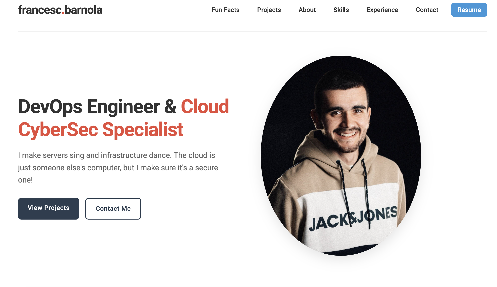

# Francesc Barnola's Portfolio



## 🚀 Live Demo

Visit my portfolio website: [https://barnolacesc.github.io/portfolio/](https://barnolacesc.github.io/portfolio/)

## 📋 Overview

This is my professional portfolio website showcasing my skills as a DevOps Engineer & Cloud CyberSec Specialist. The website highlights my:

- Technical skills
- Professional experience
- Notable projects
- Educational background
- Fun facts about me

## ✨ Features

- Responsive design that works on mobile, tablet, and desktop
- Clean, modern UI with engaging animations
- Section-based navigation
- Project showcase with links to code and live demos
- Contact information

## 🛠️ Technologies Used

- HTML5
- CSS3
- JavaScript
- Font Awesome for icons
- Google Fonts

## 🔧 Development

### Local Setup

1. Clone the repository
   ```bash
   git clone https://github.com/barnolacesc/portfolio.git
   ```

2. Open index.html in your browser
   ```bash
   open index.html
   ```

### Deployment

The site is deployed using GitHub Pages. Any push to the main branch will automatically update the live site.

## 📱 Responsive Design

The portfolio is fully responsive and optimized for:
- Mobile devices
- Tablets
- Desktop screens

## 🔮 Future Enhancements

- Add a dark mode toggle
- Implement a blog section
- Add more interactive elements
- Enhance accessibility features

## 📫 Contact

Feel free to reach out if you have any questions or would like to work together!

- Email: [contact@barnola.net](mailto:contact@barnola.net)
- LinkedIn: [linkedin.com/in/fbarnola](https://linkedin.com/in/fbarnola)
- GitHub: [github.com/barnolacesc](https://github.com/barnolacesc)

---

© 2024 Francesc Barnola. All rights reserved. 