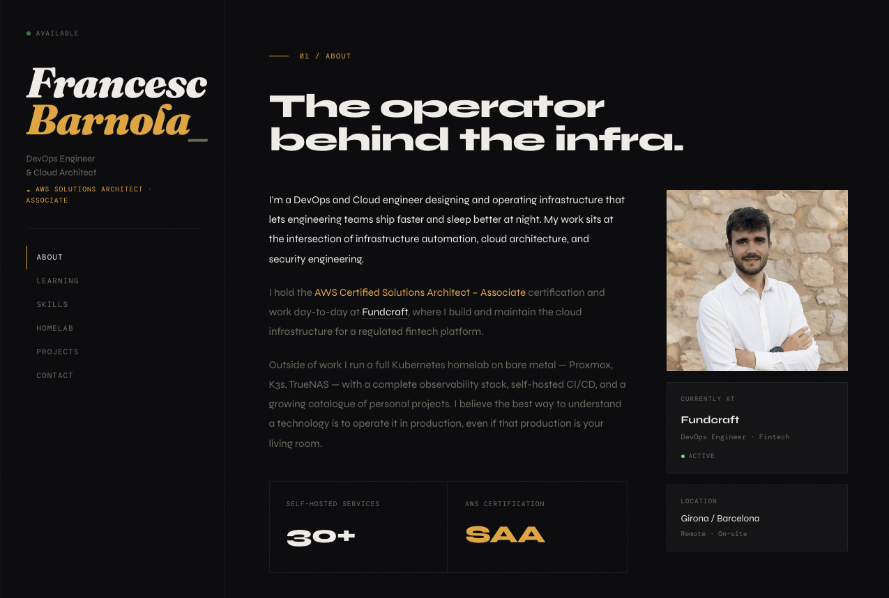

# Francesc Barnola — Portfolio



## Live

[barnola.net](https://barnola.net) · [barnolacesc.github.io/portfolio](https://barnolacesc.github.io/portfolio/)

## Overview

Personal portfolio built with **Astro** and **Tailwind CSS v4**, redesigned in early 2026. Warm dark editorial aesthetic — sticky sidebar layout, single amber accent, grain texture overlay, and a spec-sheet skills table. No glassmorphism, no purple gradients.

Sections: About · Learning · Skills · Homelab · Projects · Contact

CV download is gated behind a basic math challenge to keep bots out.

## Stack

- **Astro 5** — static site generator, zero-JS by default
- **Tailwind CSS v4** — CSS-first config, no config file
- **Google Fonts** — Fraunces (display), Syne (headings), DM Mono (labels/data)
- **GitHub Pages** — deployment via `gh-pages` action

## Local development

```bash
cd portfolio-astro
npm install
npm run dev
```

Runs at `http://localhost:4321`.

## Project structure

```
portfolio-astro/
├── src/
│   ├── layouts/Layout.astro       # HTML shell, sidebar, captcha modal
│   ├── pages/index.astro          # Page assembly
│   ├── components/
│   │   ├── Sidebar.astro          # Desktop sticky sidebar + mobile header
│   │   ├── About.astro
│   │   ├── Learning.astro
│   │   ├── Skills.astro
│   │   ├── Homelab.astro
│   │   ├── Projects.astro
│   │   ├── Contact.astro
│   │   └── CaptchaModal.astro     # Math challenge for CV download
│   └── styles/global.css          # Design system, CSS variables
└── public/
    ├── profile.jpg
    └── assets/francesc_barnola_cv.pdf
```

## Contact

- francesc@barnola.cat
- [linkedin.com/in/fbarnola](https://linkedin.com/in/fbarnola)
- [github.com/barnolacesc](https://github.com/barnolacesc)

---

© 2026 Francesc Barnola
