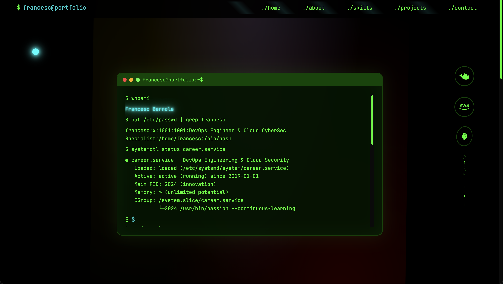

# Francesc Barnola's Portfolio



## 🚀 Live Demo

Visit my portfolio website: [https://barnolacesc.github.io/portfolio/](https://barnolacesc.github.io/portfolio/)

## 📋 Overview

This is my professional portfolio website showcasing my skills as a DevOps Engineer & Cloud CyberSec Specialist. The website features a modern, futuristic design with glassmorphism effects and interactive animations that highlight my:

- Technical skills and expertise
- Professional experience and journey
- Notable projects and achievements
- Educational background
- Personal interests and fun facts

## ✨ Features

### 🎨 Design & UI
- **Futuristic glassmorphism design** with translucent elements and backdrop blur effects
- **Dark theme** with cyan/blue accent colors and gradient backgrounds
- **Animated particle background** with floating orbs and dynamic effects
- **Interactive hover states** and smooth transitions throughout
- **Mobile-first responsive design** optimized for all devices

### 🎭 Animations & Interactions
- **Scroll-triggered animations** using Intersection Observer API
- **Floating tech icons** around profile images with orbital animations
- **Animated skill bars** with progress indicators
- **Smooth scrolling navigation** with active state indicators
- **Custom cursor effects** (desktop only)
- **Typing animation** for hero title
- **Parallax effects** and performance optimizations

### 📱 Mobile Experience
- **Adaptive layout** with profile image repositioned to About section on mobile
- **Touch-friendly navigation** with animated hamburger menu
- **Optimized content flow** for better mobile UX
- **Responsive footer** with improved spacing

### 🔧 Interactive Elements
- **Glass navigation bar** with mobile menu toggle
- **Clickable status badge** linking to LinkedIn profile
- **Project showcase** with overlay effects and external links
- **Contact form** with floating labels and validation states
- **Timeline component** for professional experience
- **Easter egg** (Konami code) with rainbow effects

## 🛠️ Technologies Used

### Frontend
- **HTML5** - Semantic markup and structure
- **CSS3** - Advanced styling with custom properties, Grid, and Flexbox
  - CSS Custom Properties (CSS Variables)
  - CSS Grid and Flexbox layouts
  - CSS Animations and Keyframes
  - Backdrop-filter for glassmorphism effects
  - CSS Transforms and Transitions
- **Vanilla JavaScript** - Modern ES6+ features and APIs
  - Intersection Observer API for scroll animations
  - Custom cursor implementation
  - Mobile menu functionality
  - Form handling and validation
  - Performance optimizations

### Design & Assets
- **Font Awesome 6.4.0** - Icon library for tech icons and UI elements
- **Google Fonts** - Inter (primary) and JetBrains Mono (code) typefaces
- **Custom animations** - Hand-crafted CSS keyframe animations
- **Responsive images** - Optimized profile and project images

### Development Tools
- **Git** - Version control with feature branches
- **GitHub Pages** - Automated deployment
- **Python HTTP Server** - Local development server
- **Modern CSS** - No preprocessors, pure CSS with modern features

## 🔧 Development

### Local Setup

1. Clone the repository
   ```bash
   git clone https://github.com/barnolacesc/portfolio.git
   cd portfolio
   ```

2. Start a local development server
   ```bash
   # Using Python 3
   python3 -m http.server 8000
   
   # Or using Node.js
   npx serve .
   ```

3. Open your browser and navigate to `http://localhost:8000`

### Project Structure
```
portfolio/
├── index.html              # Main HTML file
├── css/
│   ├── futuristic-style.css # Main styles with glassmorphism effects
│   └── additional-styles.css # Responsive and component styles
├── js/
│   └── futuristic-main.js   # Interactive functionality
├── assets/
│   ├── profile.jpg          # Profile image
│   └── francesc_barnola_cv.pdf # Resume/CV
└── README.md               # Project documentation
```

### Deployment

The site is deployed using GitHub Pages with automatic deployment:
- Any push to the `main` branch updates the live site
- The `facelift` branch contains the new futuristic design
- Custom domain support available

## 📱 Responsive Design

The portfolio features a mobile-first approach with breakpoints for:
- **Mobile devices** (< 768px) - Optimized layout with repositioned elements
- **Tablets** (768px - 1024px) - Balanced design with adjusted spacing
- **Desktop screens** (> 1024px) - Full-featured layout with all animations

### Mobile Optimizations
- Profile image moved to About section for better content flow
- Simplified navigation with animated hamburger menu
- Touch-friendly button sizes and spacing
- Optimized animations for mobile performance
- Hidden scroll indicator to prevent layout issues

## 🎯 Performance Features

- **Optimized animations** with `will-change` properties
- **Efficient scroll handling** with throttled event listeners
- **Lazy loading** for non-critical animations
- **Mobile performance** considerations with reduced motion options
- **Accessibility** features with keyboard navigation support

## 🔮 Future Enhancements

- ✅ **Futuristic glassmorphism design** (Implemented!)
- ✅ **Advanced animations and interactions** (Implemented!)
- ✅ **Mobile-optimized experience** (Implemented!)
- 🔄 **Blog section** with technical articles
- 🔄 **Project filtering** by technology stack
- 🔄 **Theme customization** options
- 🔄 **Enhanced accessibility** features
- 🔄 **Progressive Web App** capabilities

## 📫 Contact

Feel free to reach out if you have any questions or would like to work together!

- **Email**: [contact@barnola.net](mailto:contact@barnola.net)
- **LinkedIn**: [linkedin.com/in/fbarnola](https://linkedin.com/in/fbarnola)
- **GitHub**: [github.com/barnolacesc](https://github.com/barnolacesc)

---

© 2025 Francesc Barnola. Crafted with passion and precision. 